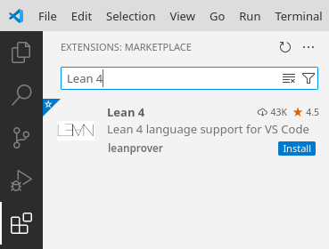
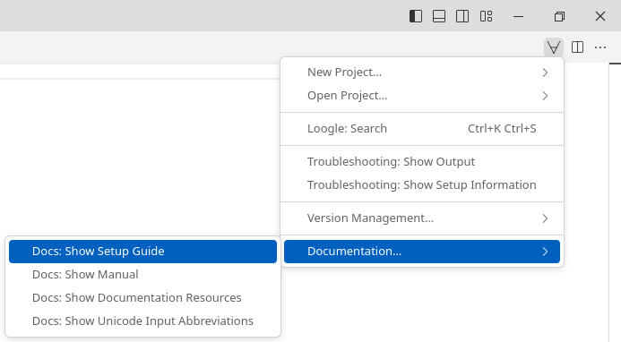
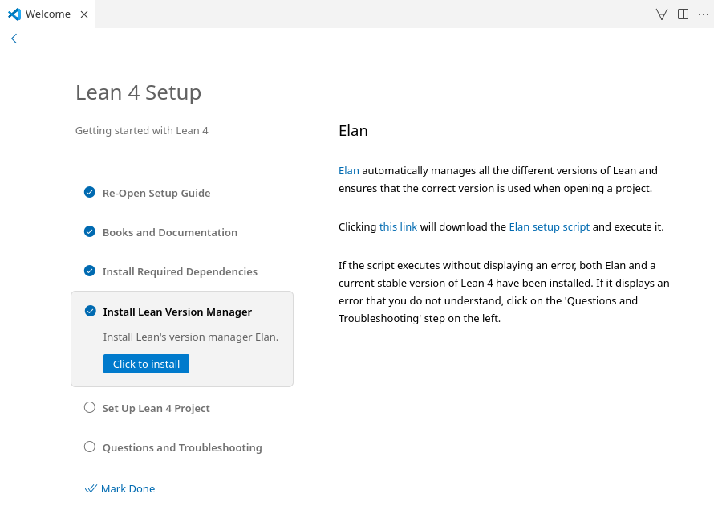

# 形式化数学：Lean 入门与应用

## 如何安装 Lean 并打开此项目

### 本地安装

1. 安装 [Visual Studio Code](https://code.visualstudio.com/)
2. 打开 Visual Studio Code 后在 `Extensions` 中搜索Lean4。 
3. 新建任意文件后，点击右上角的“∀”图标然后选择 'Documentation… > Docs: Show Setup Guide'。 
4. 按照 `Setup Guide` 的提示及可安装 Lean4。 
5. 在安装完成 Lean4后，点击右上角的“∀”图标并选择 'Open Project > Download Project'，输入以下网址
```text
https://github.com/IntroductionToLean/IntroductoryLean.git
```
跟随提示下载并打开此文件夹即可。


### 使用线上工具

点击 [](https://gitpod.io/#https://github.com/IntroductionToLean/IntroductoryLean.git)
